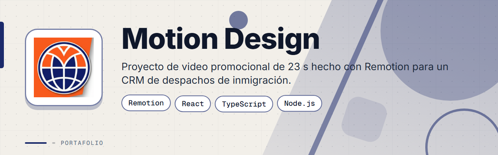
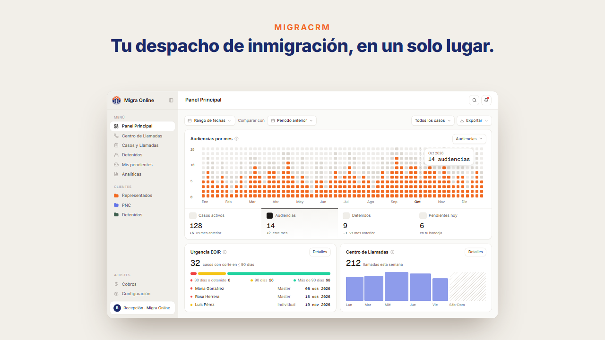
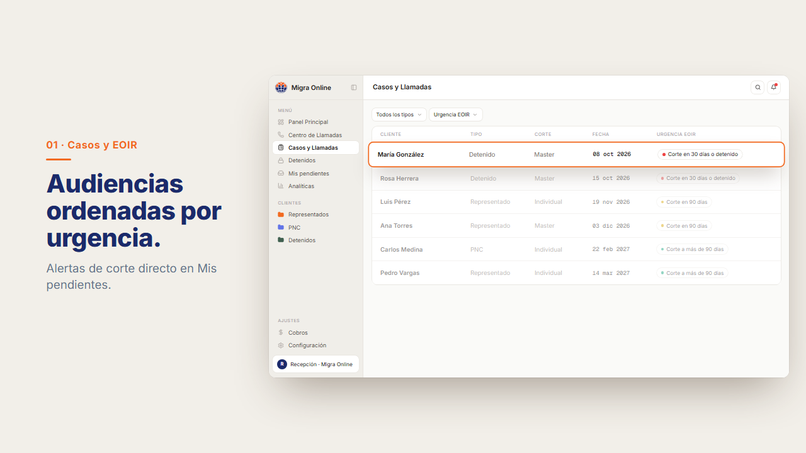
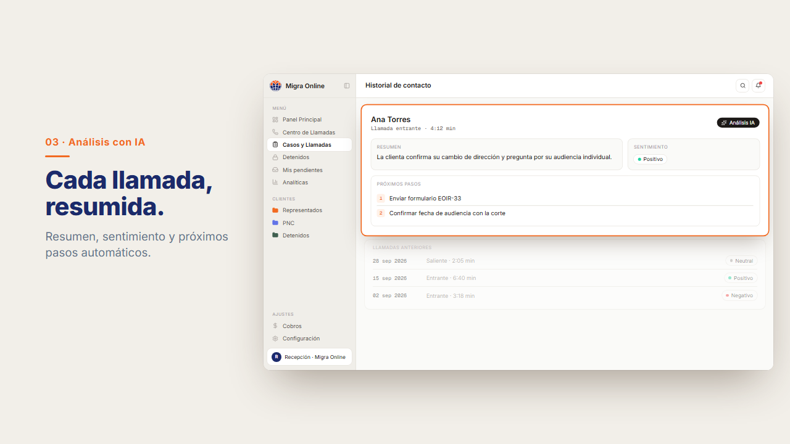
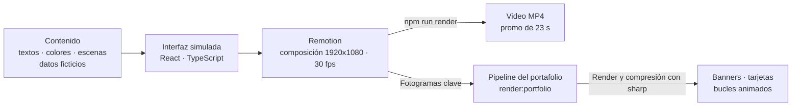

<div align="center">



# Motion Design


**Video promocional de 23 segundos hecho con Remotion para un CRM de despachos de inmigración, con una interfaz simulada y un pipeline que también genera los banners y tarjetas de este portafolio.**

</div>

> Este es un **portafolio showcase**: el código fuente es propietario y no está incluido. Todos los nombres y cifras de la interfaz simulada son ficticios.

---

## Contenido

- [El Problema](#el-problema)
- [La Solución](#la-solución)
- [Funcionalidades](#funcionalidades)
- [Vista Previa](#vista-previa)
- [Arquitectura](#arquitectura)
- [Stack Tecnológico](#stack-tecnológico)
- [Instalación local](#instalación-local)
- [Roadmap](#roadmap)
- [Contacto](#contacto)

---

## El Problema

Mostrar un producto de software en un video suele implicar editar a mano cada versión:

- Cambiar un texto o un color obliga a re-exportar desde una herramienta de edición.
- Mantener coherentes la marca, los datos de ejemplo y la duración de las escenas es tedioso.
- Un video con capturas reales expone datos de clientes.
- Los banners y tarjetas de un portafolio se hacen aparte, con otro proceso.

---

## La Solución

El video se programa como una composición de React con Remotion: 1920x1080 a 30 fps, en español, con una interfaz simulada de navegador que permanece en pantalla de la escena 2 a la 5 y solo cambia de panel y de encuadre. Textos, colores, duración de escenas y datos de ejemplo se editan desde un solo archivo y la duración total se recalcula sola. Con el mismo código, un script de render genera los banners, tarjetas y bucles animados del portafolio.

---

## Funcionalidades

| Funcionalidad | Descripción |
|---------------|-------------|
| Guion en 6 escenas | Gancho, introducción, casos, detenidos, análisis con IA y cierre, en 23 segundos |
| Interfaz simulada | Navegador con panel principal, KPIs y barra de urgencia de audiencias, todo con datos ficticios |
| Contenido editable | Textos, colores, duración de escenas y datos de ejemplo desde un único archivo de contenido |
| Duración automática | Las escenas se miden en fotogramas y el total se recalcula solo |
| Vista previa y render | Remotion Studio para previsualizar y render a MP4 desde la línea de comandos |
| Pipeline del portafolio | El script `render:portfolio` genera banners, tarjetas y bucles de los proyectos y comprime los PNG con sharp |

---

## Vista Previa

<table>
  <tr>
    <td width="50%">
      
      <br><b>Panel principal</b>: el despacho completo en una sola pantalla.
    </td>
    <td width="50%">
      
      <br><b>Casos y llamadas</b>: audiencias ordenadas por urgencia y estado de custodia.
    </td>
  </tr>
  <tr>
    <td width="50%">
      
      <br><b>Resumen de llamadas con IA</b>: resumen, sentimiento y próximos pasos de cada llamada.
    </td>
    <td width="50%"></td>
  </tr>
</table>

---

## Arquitectura



El pipeline `render:portfolio` empaqueta las composiciones, renderiza imágenes fijas y bucles, comprime los PNG con sharp para mantenerlos livianos y, con la opción de publicación, copia el resultado a las carpetas de cada showcase.

---

## Stack Tecnológico

| Capa | Tecnología |
|------|-----------|
| Video | Remotion 4 |
| Interfaz | React 19 · TypeScript · Lucide |
| Tipografías | Remotion Google Fonts |
| Imágenes | sharp (compresión de PNG) |
| Entorno | Node.js |

---

## Instalación local

> **Aviso:** el código es privado y propietario. Estos pasos son solo para colaboradores autorizados con acceso al repositorio.

1. Instala Node.js.
2. Instala las dependencias:
   ```bash
   npm install
   ```
3. Previsualiza el video en Remotion Studio:
   ```bash
   npm run studio
   ```
4. Renderiza el video final en MP4:
   ```bash
   npm run render
   ```
5. Para generar los recursos del portafolio:
   ```bash
   npm run render:portfolio
   ```

---

## Roadmap

- [ ] Versión vertical del video para redes sociales.
- [ ] Subtítulos en inglés.
- [ ] Música y efectos de sonido sincronizados con las escenas.

---

## Contacto

El código fuente es propietario. Para consultas o propuestas, escríbeme:

[](mailto:pablozam1931@gmail.com)
[%206517--1870-25D366?style=for-the-badge&logo=whatsapp&logoColor=white)](https://wa.me/50765171870)
[](https://github.com/deadlyrat)

- Correo: [pablozam1931@gmail.com](mailto:pablozam1931@gmail.com)
- WhatsApp: [(507) 6517-1870](https://wa.me/50765171870)
- GitHub: [github.com/deadlyrat](https://github.com/deadlyrat)

---

*Parte del portafolio de [deadlyrat](https://github.com/deadlyrat)*
